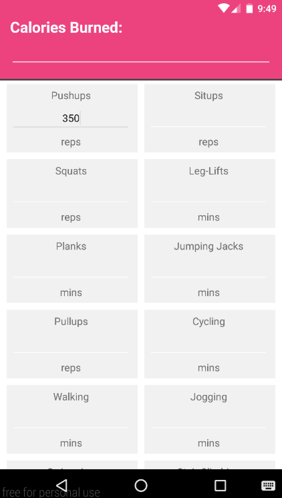

# PROG 01: Crunch Time

A simple one page app that can convert Excercises into calories burned and vice versa. 

## Authors

Marc Phillip A. Mart ([m.mart@berkeley.edu](mailto:m.mart@berkeley.edu))

## Demo Video

See [Prog01: CrunchTime (CS160 Sp 2016) ] (https://www.youtube.com/watch?v=qeW3nKfP2B0&feature=youtu.be)

## Screenshots

## Acknowledgments

A special thanks to the active students and TAs/GSIs on piazza who I continually learn from!

